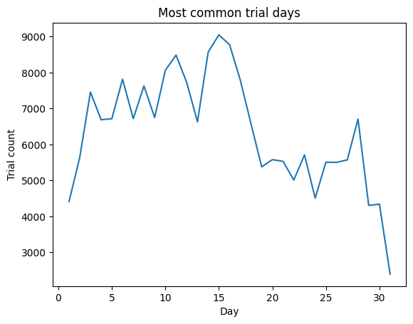

# Overview

With over **two centuries** of trial records, the *Old Bailey Proceedings Project*, published by the University of Sheffield, provides a rich dataset for analyzing historical crime trends between 1674 and 1913 at Old Bailey, one of London's main criminal courts.

This analysis is driven by the desire to explore criminal patterns over time, examining how *gender, age, punishments, and offenses* shaped more than 190.000 trials.

The original data can be found in [Old Baileys](https://www.oldbaileyonline.org/about/data) website.
## 🔎 Questions Explored  

1. **Crime Trends Over Time:**  

   - 📈 Has crime increased or decreased over the years?
    - 🔄 What major shifts occurred in different crime types?

2. **Most Common Crimes & Punishments:**  
   - 🏴‍☠️ What were the most frequently committed crimes?  
   - ⚖️ What were the most common punishments?  
   - 🕰️ Have these patterns changed over the years?  

3. **Demographics & Crime:**  
   - 👫 How do gender and age relate to crime?  
   - 🕰️ Have these relationships evolved over time?  


## 🛠️ Tools

- **Python:** Used for data analysis and extracting insights.
    - 🐼 **Pandas Library:** Data analysis.
    - 📊 **Matplotlib Library:** Data visualization.
- **Jupyter Notebooks:** For running scripts.
- **Visual Studio Code**
- **Git & GitHub:** For version control and project tracking.

## 📥 Data Collection & Preprocessing 

The dataset was collected, processed, and cleaned using the *`0_Data_Download.ipynb`* notebook.

### Methodology:  

1. 📂 **Download and Extraction**  
   - Retrieves the dataset from the Old Bailey website.  
   - Unzips and organizes the files into directories.  

2. 🔍 **Data Processing**  
   - Identifies all XML files containing trial records.  
   - Extracts following trial details using the `extract_trial_data` function:  
     - **Trial ID.**  
     - **Trial date.**  
     - **Defendant details**: age, gender, and occupation  
     - **Victim gender.**  
     -  **Verdict**: category and subcategory.  
     - **Offence**: category and subcategory.  
     - **Punishment**: category  subcategory. 
    - Stores the extracted trial data as dictionaries in the `trial_records` list.  

3. 🧹 **Data Cleanup**

   - **Converts list to DataFrame**: The `trial_records` list is converted into a pandas DataFrame.  
   - **Replaces specific values with NaN**: The `mask` function replaces empty lists (`[]`), empty strings (`' '`), and the string `'indeterminate'` with `NaN`.  
   - **Removes duplicates**: Duplicate rows are removed using `drop_duplicates()`.  
   - **Converts date column to datetime**: The `trial_date` column is converted to pandas datetime format.
   - **Exports to JSON format**: The cleaned dataset is saved as a JSON file using the `save_to_json` function.  

## 📈 Has the Number of Crimes Increased or Decreased?

This section explores how the number of trials recorded at the Old Bailey evolved over time, from 1674 to 1913.

### Methodology:  

1.  The dataset's trial_date column was used to create three new columns: trial_day, trial_month, and trial_year.  

2. The number of trials was plotted for each day, month, and year to observe trends.


### 📅 Trials Per Year

This visualization presents the evolution of criminal trials at the Old Bailey from 1674 to 1913

#### Visualization:

```
trials_per_year = df_timestamp['trial_year'].value_counts().sort_index()
plt.plot(trials_per_year.index, trials_per_year.values)
plt.xlabel('Year')
plt.ylabel('Trial count')
plt.title('Number of trials per year')
plt.show()
```
<p align="center">
  
</p>


#### Insights:

The number of trials per year at the Old Bailey was influenced by a range of historical, legal, and social factors, which can be divided into three distinct periods:
   - **1674–1778**: the relatively low number of recorded trials, along with a noticeable drop in the early 18th century, can be attributed to the **inconsistency and incompleteness of early editions** of the Proceedings, with many sessions missing from the records. However, as the Proceedings gained popularity, **public demand likely drove improvements in documentation**, contributing to a gradual increase in recorded trials leading up to the late 18th century.

   - **1778-1850**: the number of recorded trials grew significantly as the Proceedings evolved into an **official legal record**, ensuring that all cases heard at the Old Bailey were documented. Additionally, major conflicts such as the **American War of Independence (1775–1783) and the Napoleonic Wars (1803–1815)** contributed to post-war crime surges, leading to spikes in trial numbers. **Social instability, economic hardship**, and concerns over public order likely played roles in the sustained increase in prosecutions throughout the early 19th century.

   - **1850–1913**: from the mid-19th century onward, the number of recorded trials began to eventually decline, influenced by **legal reforms and changes in crime patterns**. The gradual **reduction in capital offenses** reduced the number of severe trials. With fewer subscribers and diminishing commercial viability, the Proceedings were discontinued in April 1913.
   


### 📅 Trials Per Month

This visualization illustrates the distribution of trials across different months throughout the recorded period.

#### Visualization:

```
trials_per_month = df_timestamp['trial_month'].value_counts().sort_index()
plt.plot(trials_per_month.index, trials_per_month.values)
plt.xlabel('Month')
plt.ylabel('Trial count')
plt.title('Number of trials per month')
plt.show()
```
<p align="center">
  
</p>


#### Insights:

- Major spikes in trial activity in September, which can be explained by Old Bailey's legal calendar, that began in November and ended in October. The court possibly aimed to clear cases before the end of the legal cycle.
- Wars, economic crises, and crime trends might have influenced the other spikes in January and April.

### 📅 Trials Per Day

This visualization represents the distribution of trials based on the day of the month.

#### Visualization:

```
trials_per_day = df_timestamp['trial_day'].value_counts().sort_index()
plt.plot(trials_per_day.index, trials_per_day.values)
plt.xlabel('Day')
plt.ylabel('Trial count')
plt.title('Most common trial days')
plt.show()
```
<p align="center">
  
</p>


#### Insights:

- The number of trials tends to increase around the middle of the month.

## 🏴‍☠️ What are the most common crimes committed? And most common punishments? Have they changed over the years?

This section explores the crimes that dominated the Old Bailey and how punishments evolved over time.

### Methodology:  

1.  Offenses and punishments were stored as lists, so they were exploded to facilitate analysis. 

2. Count of offences and punishments by category and subcategory, identifying outliers.

3. Analysing trends over time.


### Most common offences

This visualization presents proportion of offences.

#### Visualization: Proportion of Theft vs Other Offenses

```
offences_to_plot.plot(kind='pie',
                      autopct='%1.1f%%',
                      colormap='Paired',
                      labels=['Theft', 'Other Offenses',],
                      ylabel='',
                      )
plt.title("Proportion of Theft and Other Offenses", loc='center')
plt.show()
```
<p align="center">
  
</p>

\
Given that theft accounted for more than 70% of all offenses, other offenses are presented separately for better clarity.

#### Visualization: Proportion of Other Offenses

```
non_theft_count.plot(kind='pie',
                      autopct='%1.1f%%',
                      colormap='Set2',
                      labels=['Deception', 'Royal Offences', 'Violent Theft', 'Breaking Peace', 'Sexual', 'Kill', 'Miscellaneous', 'Damage'],
                      ylabel='',

                      )
plt.title("Proportion of Other Offenses", loc='center')
plt.show()
```

<p align="center">
  
</p>

#### Insights:

- **Theft** represented the vast majority of crimes, likely driven by the **Industrial Revolution**. As economic disparity grew, theft became a more common survival tactic. London was a pre-industrial city where every object was handmade and valuable. Items like watches, bolts of fabric, and lead were frequently stolen due to the labor-intensive nature of their production and could sustain a person for more than a week. The **lack of a formal police** force until 1839 also contributed to the rise in theft-related offenses.

- **Deception** crimes such as bankruptcy, forgery, and fraud surged with the **growth of the financial sector**, banking system, and the introduction of paper currency. These changes provided new opportunities for financial crimes.

- **Royal Offenses**, including treason, tax evasion, and smuggling, made up a significant portion of the crime data. **The French Revolution** (1789–1799) heightened the government’s sensitivity to revolutionary ideas, leading to persecution. Additionally, **high taxes on imported goods** fostered a black market economy.

- The legal system during this period was **more focused on protecting property** rather than ensuring justice for the lower class. This focus can explain why crimes like property damage (arson, vandalism) were less frequent.

#### Visualization: Crime subcategories proportion

```
crime_subcategories = {
    "Kill": kill_sub,
    "Sexual": sexual_sub,
    "Breaking Peace": breaking_sub,
    "Deception": deception_sub
}

fig, axes = plt.subplots(2, 2, figsize=(12, 10))
axes = axes.flatten()

for i, (category, data) in enumerate(crime_subcategories.items()):
    data.plot(kind='pie',
              ax=axes[i],
              autopct='%1.1f%%',
              startangle=90,
              labels=data.index,
              colormap='Set2',
              ylabel='')
    axes[i].set_title(f"Top Subcategories for {category} Crimes")

plt.tight_layout()
plt.show()
```

<p align="center">
  
</p>

#### Visualization: Crime categories proportion over time

```
offences_trend_over_time['deception'].sort_index().plot(
                    kind='line',
                    label='Deception',)

offences_trend_over_time['sexual'].sort_index().plot(
                    kind='line',
                    label='Sexual')

offences_trend_over_time['breakingPeace'].sort_index().plot(
                    kind='line',
                    label='Breaking peace')

offences_trend_over_time['kill'].sort_index().plot(
                    kind='line',
                    label='Kill')

plt.legend(title='Offense Types')

plt.title('Offense Counts Over Time Without Theft', fontsize=16)
plt.grid(color='gray', linestyle='--', linewidth=0.5, alpha=0.7)
plt.xlabel('Year', fontsize=12)
plt.ylabel('Count of Offenses', fontsize=12)

plt.show()
```
<p align="center">
  
</p>


<p align="center">
  
</p>


#### Insights:

- Deception was the most common offense (26.4%), reflecting London's growing financial sector and rise in fraud and forgery.

- Murder (51.7%) and manslaughter (39.8%) dominated killings. Infanticide (8.4%) suggests deeper social struggles, possibly linked to poverty and stigma around illegitimate children.

- Crime rates spiked in the 1800s, justified by urbanization, better policing, stricter laws and more crimes being recorded.


### Most common punishments

```
top_punishment_counts.plot(
    kind='pie',
    autopct='%1.1f%%',
    colormap='Set2',
    labels=top_punishment_counts.index,
    ylabel='',
)
plt.title('Top Punishment Categories', loc='center')
plt.show()
```


<p align="center">  </p>

#### Punishment Counts Over Time

```
punishments_trend_over_time['death'].sort_index().plot(
                    kind='line',
                    label='Death',)

punishments_trend_over_time['miscPunish'].sort_index().plot(
                    kind='line',
                    label='Miscelaneous')

punishments_trend_over_time['corporal'].sort_index().plot(
                    kind='line',
                    label='Corporal')

punishments_trend_over_time['transport'].sort_index().plot(
                    kind='line',
                    label='Transport')

punishments_trend_over_time['imprison'].sort_index().plot(
                    kind='line',
                    label='Imprison')

plt.legend(title='Punishment Types')

plt.title('Punishment Counts Over Time', fontsize=16)
plt.grid(color='gray', linestyle='--', linewidth=0.5, alpha=0.7)
plt.xlabel('Year', fontsize=12)
plt.ylabel('Count of Punishments', fontsize=12)

plt.show()
```

<p align="center">  </p>


#### Insights:

- From the mid-eighteenth century, the use of the death penalty began to decline, and transportation became the dominant punishment, especially to North America and later Australia.

- Between 1787 and the 1840s, transportation to Australia and imprisonment in Britain became the dominant forms of punishment, as execution and corporal punishments decreased. In the second half of the nineteenth century, imprisonment emerged as the most common form of punishment.

- The decline in public executions and the movement toward private punishments, such as imprisonment and transportation, mirrored growing concerns about the reformability of offender and emphasis on reforming rather than punishing.

## What is the relation between gender and crime committing? Has it changed over the years?

#### Visualization: Defendant's Gender Proportion of Trials
```
df_gender_plot.plot(kind='pie',
                    y='count',
                    autopct='%1.1f%%',
                    colormap='Paired',
                    labels=['Male', 'Female',],
                    ylabel='',
                    )
plt.title("Defendant's Gender Proportion of Trials", loc='center')
plt.show()

```
<p align="center">  </p>

#### Visualization: Gender Distribution Over Time

```
df_gender_time_plot['male'].sort_index().plot(
                    kind='line',
                    label='Male',)

df_gender_time_plot['female'].sort_index().plot(
                    kind='line',
                    label='Female')
plt.legend(title='Gender')

plt.title('Gender Distribution Over Time', fontsize=16)
plt.grid(color='gray', linestyle='--', linewidth=0.5, alpha=0.7)
plt.xlabel('Year', fontsize=12)
plt.show()

```
<p align="center">  </p>

#### Visualization: Gender Distribution Over Offences

```
fig, axes = plt.subplots(1, 2, figsize=(12, 10))

female_gender_offense_plot[female_gender_offense_plot.index != 'theft'].plot(kind='pie',
                      autopct='%1.1f%%',
                      colormap='Set2',
                      ylabel='',
                      startangle=0,
                      ax=axes[0]
                      )

male_gender_offense_plot[male_gender_offense_plot.index != 'theft'].plot(kind='pie',
                                                                        autopct='%1.1f%%',
                                                                        colormap='Set2',
                                                                        ylabel='',
                                                                        startangle=0,
                                                                        ax=axes[1]
                                                                         )

axes[0].set_title('Female Distribution of Offences Without Theft')
axes[1].set_title('Male Distribution of Offences Without Theft')
plt.show()
```
<p align="center">  </p>


#### Insights:

- Historically, the proportion of female defendants in criminal cases was always lower than that of males. Although there was a brief period around the turn of the eighteenth century when women slightly outnumbered men, this was an exception.

- Men had a higher representation on violent crimes, which were more frequently prosecuted. In contrast, women were frequently associated with offences such as theft and fraud. These characteriscts explain men's protagonism on crime commiting percentages.

- Men were more active in the public sphere and had greater opportunities to engage in criminal behaviour, particularly in workplaces, public spaces, and criminal networks.

## 🎬 Conclusion

By now, we have explored trends in crime, offense types, punishments, and gender differences. These insights lay the foundation for understanding the societal shifts that influenced crime rates and the justice system. Some key points can be made:

- The rise in crime during the Industrial Revolution is particularly notable. The mass migration to urban areas, poverty, and the rise of new crimes like fraud and deception coincided with growing industrial wealth.

- Punishments evolved from physical (e.g., whipping) to institutionalized ones (e.g., imprisonment or transportation), reflecting changing attitudes toward rehabilitation.

- Gender dynamics highlight how crime and punishment were shaped by social roles—men were largely involved in violent crimes, while women were more likely to be arrested for non-violent crimes like theft.

## 💡 Future explorations

- Relationship between occupation and age with crime commiting.
